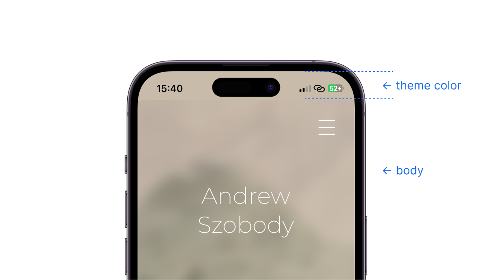

## Understanding the files you’ll need to edit

At the bare minimum, every website is at least a single HTML file, usually called `index.html`. This is a plain text file with content formatted using opening and closing tags:

```html
<h1>Here is a heading</h1>

<p>Here is a paragraph of text. Some words are in <em>italics<em>
while others are in <strong>bold</strong>.</p>

<button>
    Here is a button…
    <button>
        With another button inside of it for some reason.
    </button>
</button>
```

You can also have a CSS file, `style.css`. While HTML is for adding content to the webpage, CSS is for styling that content. In CSS, you first type out what part of the HTML you want to style, then you add styling information between braces:

```css
h1 {
  font-size: 24px;
  color: rgb(92, 118, 116);
}

p {
  font-size: 14px;
  color: var(--text-color-primary);
}

button {
    padding: 20px;
}
```

In the example above, `var(--text-color-primary)` refers to a variable. You can create whatever variables you want at the top of the CSS document: 

```css
:root {
    --theme-color-1: rgba(200, 187, 170, 1);
    --theme-color-2: rgb(230, 237, 226);
    --text-color-primary: rgb(111, 100, 86);
    --etc.
}
```

By modifying these variables, you modify everything that is styled using them, which is practical in that you don’t have to make a bunch of identical edits.

The third core file type used to display a website is javascript, usually called `script.js`. While HTML adds content and CSS styles it, javascript uses logic to manipulate that content dynamically — you could think of javascript as the biggest difference between a webpage and a Word document.

It’s javascript that allows us to say: "When I click this image of a back arrow, check and see if there is a previous entry in our website history. If there is, navigate back to it. If there isn’t, go to the home page."

```js
function backButton() {
    if (history.length > 1) {
        history.back();
    } else {
        window.location.hash = 'home';
    }
}
```

While you’ll need to edit the HTML to add captions to new works in a gallery, and while you’ll need to edit CSS to pick you preferred colors and such, I don’t think you should ever need to edit the javascript.

There are other files in the repository, like images and fonts, and but they’re all there to be grabbed and used by those three core documents.


## Editing files on Github

You can edit files directly from this page by navigating the list of repository contents above, then hitting the edit button on the top-right. When you save changes (or "commit"), you’ll be prompted for a commit message, e.g., "update CSS color variables".

You can add new files just by dragging and dropping.


## Editing files locally

If you want to be able to make changes to the website while 1] being able to view those changes before they go live and 2] avoid inadvertently causing issues with your edits, you’ll need to install a couple of things.

#### 1. Github desktop app

[Here](https://youtu.be/PvUexC0-D2s) is a short and straightforward guide for setting up the Github desktop app. The app allows you to work on a local copy of the website files. Once you want your edits to go live, you sync your copy with Github.

#### 2. Text editor

Once you have your local copy of the website files, you’ll need a text editor to edit them. [Sumblime Text](https://www.sublimetext.com/) is a lightweight and free option.

Say you want to edit CSS variables in order modify the gallery background color. Locate the `style.css` file in the, right click on it, and select `Open With > Sublime Text`. 

In order to preview how your edits to the text files effect the webpage, open `index.html` (it should open in your default browser). To continue seeing changes as you add edits, just remember to hit save in your text-editor, then refresh in the browser.


## Managing image file size

The largest files your website has to load are the images. Every additional megabyte of images could add over a second of load time to the page it’s on. It’s probably a good idea to try and keep images below 500KB a piece whenever you can.

You can reduce file size either by shrinking the image dimensions (resolution) or by increasing compression. Here’s how to do both on a mac:

In Apple Preview, hitting Cmd-0 will zoom the open image to 100% which can give you an idea of how much resolution you have and if you can sacrifice some to decrease file size. Hit `Tools > Adjust Size…` to decrease the dimensions of the image.

To increase compression, hit `File > Export…`, select `JPEG` as the format and use the `Quality` slider to target different file sizes. Once the image is exported, check it to make sure there aren't super obvious [compression artifacts](https://external-content.duckduckgo.com/iu/?u=https%3A%2F%2Ftechterms.com%2Fimg%2Fxl%2Fartifact_1543.png&f=1&nofb=1&ipt=7cee300beb5f2a79c7ab6bc4e254e57e9dd81e4b977887cb6b0cd73c5ccc8d3e&ipo=images) (compression artifacts aren't the same thing as pixelation; you can have a high-res image with bad artifacting).

A handy tool for managing images (as well as other elements of the website that effect load time) is [pagespeed.web.dev](https://pagespeed.web.dev/). It flags images that it thinks could be further compressed without effecting visual quality and estimates how much space can be saved.


## Adding new images to galleries

Each gallery has a dedicated sub-folder in `/artwork` with a one-word name: `recent`, `less`, and `old`.

Dropping `.jpeg` files into these subfolders with the following naming convention will cause them to show up in the corresponding gallery: 

- `01.jpeg`
- `02.jpeg`
- etc.
- `15.jpeg`

By default, galleries are set up for 15 images, but more could be added.

In order to add a caption to a new image — or to modify a caption — open the HTML document and search for the image path (e.g. `artwork/less/04.jpeg`) in order to locate the correct work. Just under the image path, fill out `fig-title`, `fig-medium`, and `fig-dimensions`:

```html
<div class="img-container">
    
</div>
<figcaption class="">
    <div class="fig-title">Put title here</div>
    <div class="fig-details">
        <div class="fig-medium">Put medium here</div>
        <div class="fig-dimensions">Put dimensions here</div>
    </div>
</figcaption>
```

That should be it!

## Changing home page wallpaper

The current image for the home page wallpaper is in the `/wallpaper` folder. Remove this file by placing it in the `/inactive` sub-folder, then add your new image to `/wallpaper`.

The wallpaper image needs to be a file with the `.jpeg` extension (not `.jpg`), should have an aspect ratio of either 4:3 (landscape), 3:4 (portrait), or 1:1, and needs to be named accordingly, like so:

- `4x3.jpeg`
- `3x4.jpeg`
- `1x1.jpeg`


When swapping wallpapers, it’s a good idea to update the `theme-color-1` variable in the CSS file to match: 

```css
:root {
    --theme-color-1: rgba(200, 187, 170, 1);
    /* theme-color-1 is used for the home page background */
    --theme-color-2: rgb(230, 237, 226);
    /* theme-color-2 is used for the gallery background */
    …
```

… as well as the content of the `theme-color` meta element in the HTML head (at the very top of the document): 

```html
<head>
    <meta charset="UTF-8">
    <meta name="viewport" content="width=device-width, initial-scale=1.0">
    <title>Andrew Szobody</title>
    <meta name="theme-color" content="rgba(200, 187, 170, 1)">
    …
```

The CSS variable `theme-color-1` is used for the home screen body background color, which is behind the wallpaper image. It’s revealed when scrolling bounces or when you refresh on mobile (see below). The HTML `theme-color` is used by browsers to tint some of their ui elements. Safari in iOS uses it for the status bar: 




## Changing page names

To rename a page, search for its current name in the html file. You should get two results: the menu link to that page, and then the heading on the page itself.

The menu links look like this: 

```html
<nav id="nav-list">
    <p id="link-recent" class="menu-item"><a href="#recent">Recent works</a></p>
    <p id="link-less" class="menu-item"><a href="#less">Less recent</a></p>
    […]
</nav>
```

And page headings look like this: 

```html 
<main id="less-main" class="page sleeping">
    <h1>Less recent works</h1>
    […]
</main>
```

Just retype whatever name you want in these two places, between the tags that they’re wrapped in. Don’t update anything else, like IDs or whatnot, since a bunch of stuff in the CSS and javascript files are tied to them. They’ll just have to not match.


## Adding a gallery

There’s an extra gallery already created that you could use if you need it. In the list of menu items, there’s a hidden link to it that you can activate to make it accessible:

```html
<nav id="nav-list">
    […]
    <p id="link-old" class="menu-item"><a href="#old">Old works</a></p>
    <!-- <p id="link-g4" class="menu-item"><a href="#g4">Gallery 4</a></p> -->
    <p id="link-bio" class="menu-item"><a href="#bio">About/Contact</a></p>
</nav>
```

The link with the text "Gallery 4" is wrapped in comment syntax, `<--` and ` -->`, which turns it into a note that’s not taken into account on the rendered page. Remove that comment syntax and the link will then appear in the navigation menu.

Adding another link to the menu means that pages need to slide down a little further on mobile for the menu not to be cramped. The `--mobile-slidedown-height` variable in the CSS file will need to be adjusted from `30rem` to something like `34rem`.

To add works to the new gallery, just create a `g4` subfolder in the `artwork` folder. Or, if you would rather match this subfolder’s name to your new gallery name, you can do that but you’ll just need to update the path for the gallery images in the html file. Search `/g4/` in the html file, make sure this returns 15 results, then replace all 15 with `/your-new-folder-name/`.

That should be it!