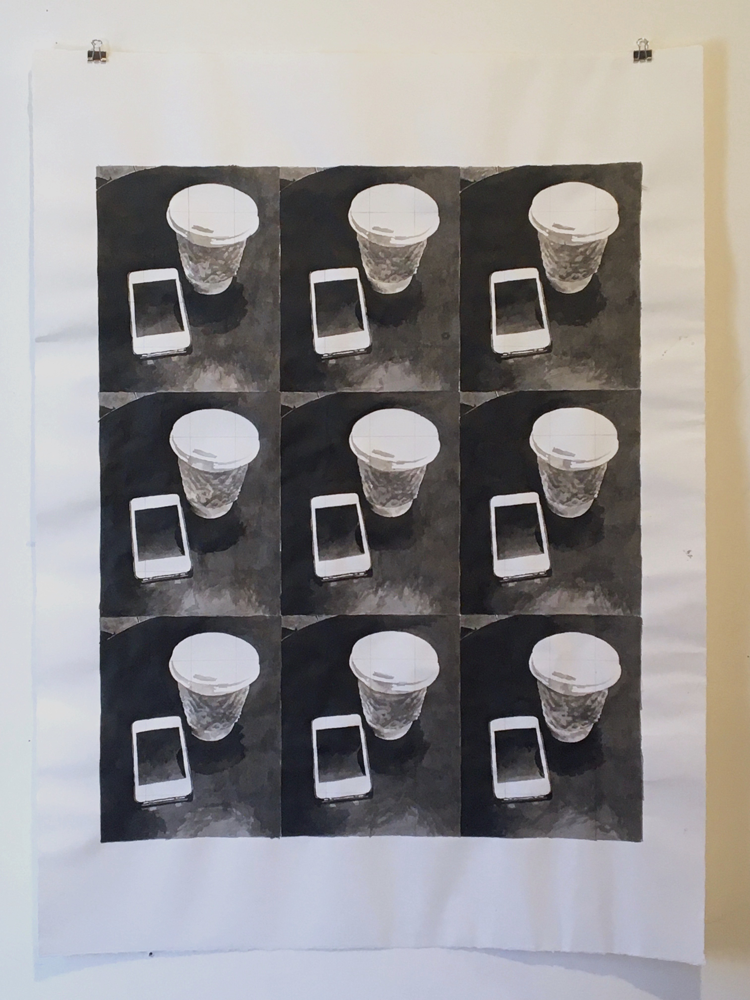
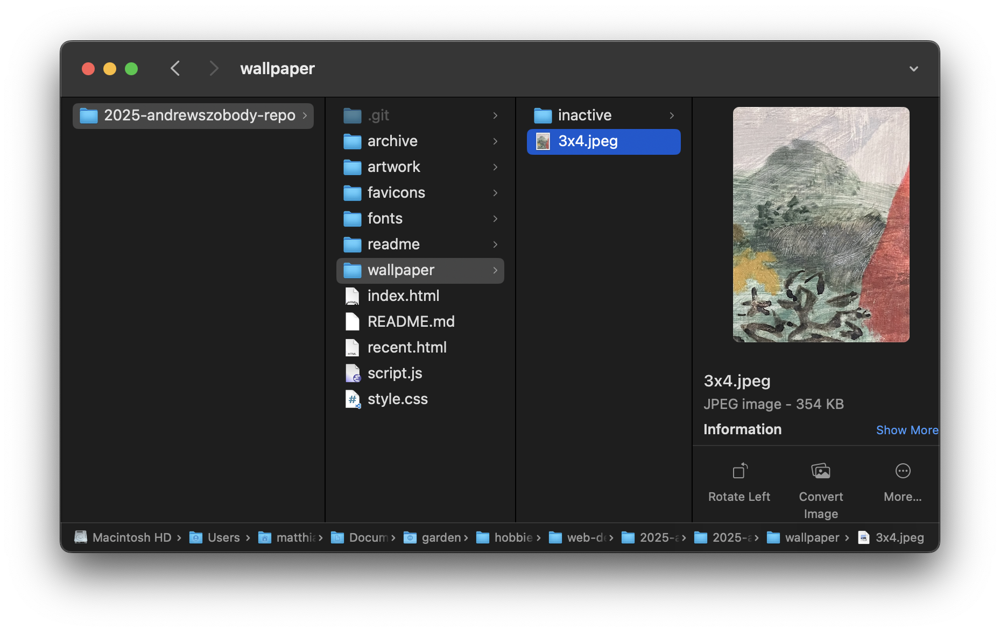
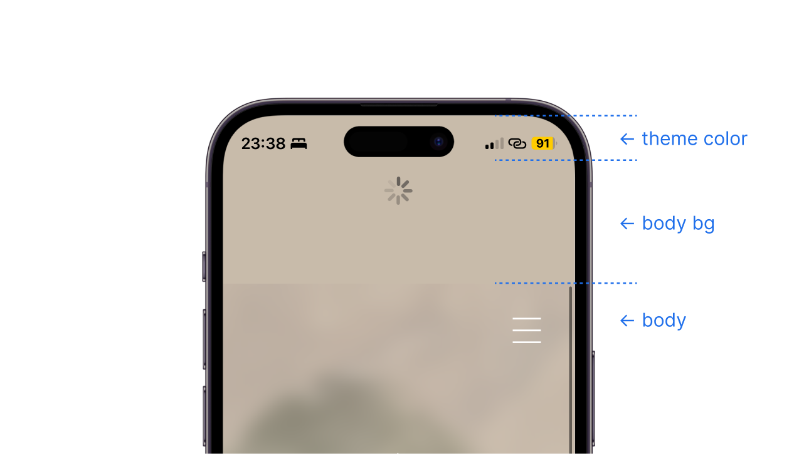

## Understanding the files you’ll need to edit

At the bare minimum, every website is at least a single HTML file, usually called `index.html`. This is a plain text file with content formatted using opening and closing tags:

```html
<h1>Here is a heading</h1>

<p>Here is a paragraph of text. Some words are <em>emphasized<em> (i.e. in italics) 
while others are in <strong>bold</strong>.</p>

<button>Here is a button</button>
```

In our case, we also have a CSS file, `style.css`. While HTML is for adding content to the webpage, CSS is for styling that content. In CSS, you first type out what part of the HTML you want to style, then you add styling information between curly braces:

```css
h1 {
  font-size: 24px;
  color: rgb(92, 118, 116);
  margin-bottom: 20px;
}

p {
  font-size: 14px;
  color: var(--text-color-primary);
}
```

`var(--text-color-primary)` refers to a variable by name. All such variables are defined at the top of the CSS document: 

```css
:root {
    --theme-color-1: rgba(200, 187, 170, 1);
    --theme-color-2: rgb(230, 237, 226);
    --text-color-primary: rgb(111, 100, 86);
    --etc.
}
```

By modifying these variables, you modify everything that is styled using them. This makes it easy to do things like change text color across the board (rather than change the text color of paragraphs, figure captions, etc. one by one).

The third core file type used in a website is javascript, usually called `script.js`. While HTML adds content and CSS styles it, javascript uses logic to manipulate and engage that content dynamically — javascript is the biggest difference between a webpage and a Word document.

It’s javascript that allows us to say: "When I click this image of a back arrow, check and see if there is a previous entry in our website history. If there is, go back to it. If there isn’t, go to the home page."

```js
function backButton() {
    if (history.length > 1) {
        history.back();
    } else {
        window.location.hash = 'home';
    }
}
```

While you’ll need to edit the HTML to add captions to new gallery items (see below), and while you’ll need to edit CSS to pick you prefered colors and such (see below), I don’t think you should ever need to edit the javascript.

There are other files in the repository, like images and fonts, and but they’re all there to be grabbed and used by those three core documents.


## Managing image file size

By far the largest files your website has to load are the images. Every additional 1MB image file could add over a second of load time to the page it’s on. It’s probably a good idea to try and keep images below 1/2MB or 500KB whenever you can.

You can reduce file size either by reducing the image dimensions (resolution) or increasing compression. Here’s how to do both on a mac:

In Apple Preview, hitting Cmd-0 will zoom the open image to 100% which can give you an idea of how much resolution you have and if you can sacrifice some to decrease file size. Hit `Tools > Adjust Size…` to decrease the dimensions of the image.

To increase compression, hit `File > Export…`, select `JPEG` as the format and use the `Quality` slider to target different file sizes. Once the image is exported, check it to make sure there aren't super obvious [compression artifacts](https://external-content.duckduckgo.com/iu/?u=https%3A%2F%2Ftechterms.com%2Fimg%2Fxl%2Fartifact_1543.png&f=1&nofb=1&ipt=7cee300beb5f2a79c7ab6bc4e254e57e9dd81e4b977887cb6b0cd73c5ccc8d3e&ipo=images) (compression artifacts aren't the same thing as pixelation; you can have a high-res image with bad artifacting). If artifacts are too visible, export again with the `Quality` slider set higher.

A handy tool to check image compression (as well as other elements of the website that effect load time) is [pagespeed.web.dev](https://pagespeed.web.dev/). It flags images that could be further compressed without effecting visual quality and estimates how much space could be saved.


## Adding new images to galleries

Each gallery has a dedicated sub-folder in `/artwork` with a one-word name: `recent`, `less`, and `old`.

Dropping `.jpeg` files into these subfolders with the following naming convention will cause them to show up in the corresponding gallery: 

- `01.jpeg`
- `02.jpeg`
- etc.
- `15.jpeg`

By default, galleries are set up for 15 images, but more can be added into the HTML file. You can change whether these images are displayed in numerical order or reverse numerical order by modifying the `gallery-order` variable in the CSS file.

In order to add a caption to a new image — or to modify a caption —, open the HTML document and search for the image path (e.g. `artwork/less/04.jpeg`) in order to locate the correct work, which in the HTML is a `<figure>` element. Inside this figure, fill out `fig-title` and `fig-medium` (remove the comment syntax, `<!--` and `-->`, which hide my comments from end users):

```html
<figure>
  
  <figcaption>
    <div class="fig-title"> <!--Put title here--> </div>
    <div class="fig-medium"> <!--Put medium, dimensions here--> </div>
  </figcaption>
</figure>
```

That should be all!

## Changing home page wallpaper

The current image for the home page wallpaper can be found in the `/wallpaper` folder. Remove this file by placing it in the `/inactive` sub-folder, then add your new image to `/wallpaper`.

The wallpaper image needs to be a file with the `.jpeg` extension (not `.jpg`), should have an aspect ratio of either 4:3 (landscape), 3:4 (portrait), or 1:1, and needs to be named accordingly, like so:

- `4x3.jpeg`
- `3x4.jpeg`
- `1x1.jpeg`



When swapping wallpapers, it’s a good idea to update the `theme-color-1` variable in the css file to match: 

```css
:root {
    --theme-color-1: rgba(200, 187, 170, 1);
    /* theme-color-1 is used for the home page background */
    --theme-color-2: rgb(230, 237, 226);
    /* theme-color-2 is used for the gallery background */
    --etc.
```

… as well as the `theme-color` meta element in the html head: 

```html
<head>
    <meta charset="UTF-8">
    <meta name="viewport" content="width=device-width, initial-scale=1.0">
    <title>Andrew Szobody</title>
    <meta name="theme-color" content="#c8bbaa"> <!--Match this to page background color-->
    <etc.>
```

`theme-color-1` is used for the home screen body background, which is revealed when scrolling bounces or when you refresh on mobile (see below), while `theme-color` is used by browsers to tint some of their ui elements. Safari in iOS uses it for the status bar: 




## Editing files locally

If you want to be able to make changes to the website while 1] being able to view those changes before they go live and 2] avoid inadvertently  causing issues with your edits, you’ll need to install a couple of things.

#### 1. Github desktop app

[Here](https://youtu.be/PvUexC0-D2s) is a short and straightforward guide for setting up the github desktop app. The app allows you to work on and view a local copy of the website files. Once you want your edits to go live, you sync your local copy with GitHub.

<!--When several people work on the same project, collaborators usually create "branches" of a project. These branches are copies of the website files that allow you to freely experiment and test changes without effecting other collaborators.

I think we can get away with not setting up branches as long as we are editing our own local copies of the website files, and as long as we only "comit" (save changes in the github app) and "push" (sync the files) when our edits are final and we’ve checked that they haven’t broken anything.-->

#### 2. Text editor

Once you have your local copy of the website files, you’ll need a text editor to view and edit them. [Sumblime Text](https://www.sublimetext.com/) is a good lightweight and free option.

Say you want to edit CSS variables in order modify the gallery background color. Locate the `style.css` file in the, right click on it, and select `Open With > Sublime Text`. 

In order to preview how your edits to the text files effect the final product, open `index.html` (it should automatically open in a browser). To continue seeing changes as you add edits, just remember to hit save in your text-editor, and then refresh in the browser.
